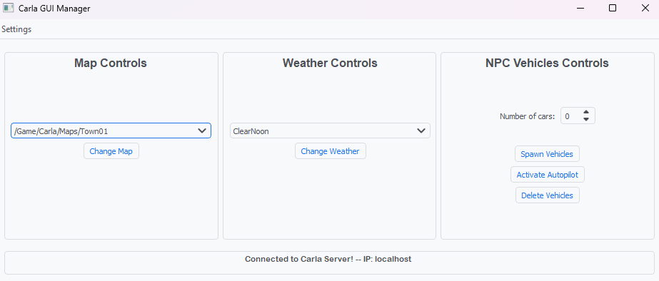

# CARLA GUI Manager

### This application focused on the Carla client can manage:

- Map selection
- Weather and time of day
- NPC vehicles

### Extra functionalities:

- Different Ips and ports
- Theme customization

---

## TODO

- Change car physics to adapt to different weather
- Save the theme preference

## Known Issues

- When connecting to the CARLA server if the connection time expires, it's impossible to catch the error with a try except, i don't know why, tried everything, so the program crashes, if that happens, simply boot it again.
- Also if a map loading takes longer than the connection time, the runtime exception happens and the program crashes, to prevent that i've put the connection time to 15 seconds, which should be enough, but again, the problem still lies with me not being able to catch the exception. For the great majority of maps this won't happen.

---

## How to run

1. `pip3 install -r requirements.txt`
2. Run Carla server
3. `python3 main.py`

---

## My Next project

I'm going to build an ego vehicle and then display the sensors' information in one or multiple windows, possible with pygame or another framework.

---

Feel free to leave suggestions or complaints. Always receptive of criticism.